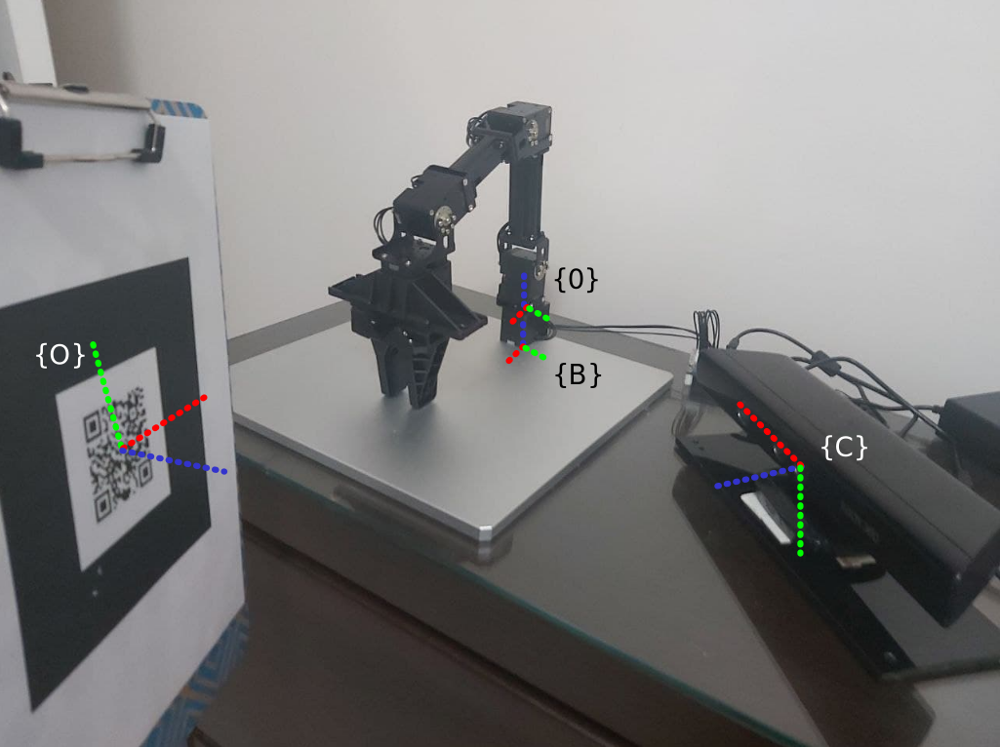

# Moving object Visual Servoing and Grasping using Open Manipulator

VSGraspingNode is a ROS-based implementation for performing vision-based grasping operations for a moving object. This node is responsible for receiving object pose information, handling start commands for visual servoing (VS), and executing grasping actions. It also includes utility functions for matrix operations and coordinate transformations. The setup uses Open Manipulator and Kinect.

  
  

## Coordinate Frames

The following picture indicates some of the coordinate frames in the system, including the object, the base, the first arm's joint, and the eye-to-hand fixed camera.

  

## Features

- Subscriber Management: Subscribes to topics for object poses, start commands for visual servoing, and grasp commands.

- Service Management: Manages service clients for task space and joint space operations.

- Matrix Operations: Provides utility functions for 3x3 and 4x4 matrix multiplication and matrix-vector multiplication.

- Transformation Calculation: Computes transformations using pose data for grasping operations.

## Topics

### Subscribed Topics

- /visp_auto_tracker/object_position

  - Type: geometry_msgs/PoseStamped

  - Description: Provides the position of the object to be grasped using ViSP tracker package

- /start_VS

  - Type: uam_msgs/StartVS

  - Description: Starts the visual servoing process.

- /grab_it

  - Type: uam_msgs/GrabIt

  - Description: Executes the grasping action.

## Services

### Service Clients

- goal_task_space_path_position_only

  - Type: open_manipulator_msgs/SetKinematicsPose

  - Description: Moves the manipulator in task space.

- goal_tool_control

  - Type: open_manipulator_msgs/SetJointPosition

  - Description: Controls the joints of the manipulator.

## Parameters

### Configurable Parameters

- vs_grasping_loop_rate

  - Type: double

  - Default: 5

  - Description: Sets the loop rate for the VS grasping process.

- manual_grasping

  - Type: bool

  - Default: true

  - Description: Enables or disables manual grasping.

## Function Descriptions

- object_pose_cb

  - Input: geometry_msgs::PoseStamped

  - Description: Callback to receive the object's pose.

- start_VS_cb

  - Input: uam_msgs::StartVS

  - Description: Callback to start visual servoing.

- grab_it_cb

  - Input: uam_msgs::GrabIt

  - Description: Callback for executing the grasping action.

- init

  - Description: Initializes the node, sets parameters, and creates subscribers and service clients.

  - createSubscribers

  - Description: Initializes all topic subscribers.

- createServices

  - Description: Initializes all service clients.

- calculateTransformation

  - Description: Computes transformations using object pose data for grasping operations.

### Matrix Utility Functions

- matMult_4x4

  - Multiplies two 4x4 matrices.

- matMult_3x3

  - Multiplies two 3x3 matrices.

- matVecMult

  - Multiplies a 4x4 matrix with a 4-element vector.

## How to Use

- Clone this repository and 'catkin build' it in a ROS workspace.

- In a terminal:
  - $ roslaunch manipulator_grasping vs_grasping.launch

## Dependencies

- ROS melodic

- geometry_msgs

- open_manipulator_msgs
